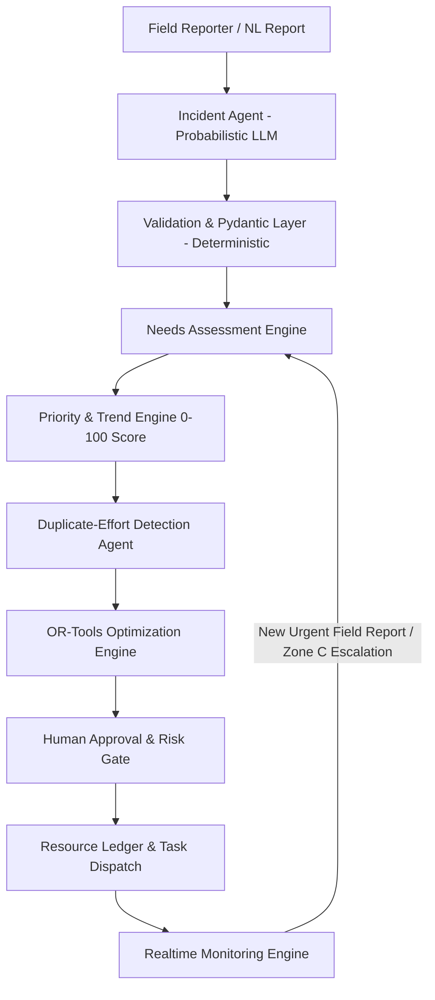

# Implementation Plan — KSHETRA Emergency Response Platform

**KSHETRA** (*Knowledge-based Humanitarian Emergency & Tactical Resource Allocation*) is an end-to-end agentic emergency response and resource orchestration system. It converts unstructured field reports into validated intelligence, mathematically optimized resource allocations (using Google OR-Tools), inter-agency coordination tasks, dynamic reallocations, explainable decision graphs, and complete auditable response histories.

---

## Technical Architecture Overview



---

## Monorepo Architecture (`kshetra/`)

```
kshetra/
├── apps/
│   ├── api/                      # Python FastAPI Backend
│   │   ├── app/
│   │   │   ├── main.py           # FastAPI entrypoint & WebSockets
│   │   │   ├── core/             # Security, JWT, RBAC, Config, Database DB session
│   │   │   ├── models/           # SQLAlchemy DB Models (Zones, Incidents, Needs, Resources, Allocations, Tasks, Audits)
│   │   │   ├── schemas/          # Pydantic Schemas & DTOs
│   │   │   ├── services/         # Business logic services
│   │   │   ├── agents/           # LangGraph / Agentic Orchestration (Incident, Needs, Priority, Duplicate, Coordination, Supervisor)
│   │   │   ├── optimizer/        # Google OR-Tools allocation & fallback greedy solvers
│   │   │   ├── realtime/         # WebSocket manager & event broadcaster
│   │   │   └── api/              # REST Endpoints (Auth, Incidents, Zones, Resources, Allocations, Tasks, Alerts, Audit, Demo)
│   └── web/                      # React 18 + Vite + TypeScript Frontend
│       ├── src/
│       │   ├── components/       # UI Components (Sidebar, Header, Metrics, Reallocation Diff, Decision Trace)
│       │   ├── pages/            # Navigation Views (CommandCenter, Incidents, Zones, Resources, Allocation, Coordination, Alerts, Simulator, Analytics, AIActivity, Audit, Settings)
│       │   ├── map/              # MapLibre GL JS geospatial viewer & layer controls
│       │   ├── charts/           # Recharts visualization widgets
│       │   ├── services/         # Axios API & WebSocket Client
│       │   ├── stores/           # Zustand state management
│       │   └── types/            # TypeScript interfaces
├── db/
│   └── seed.py                   # Demo scenario generator (5 zones, 6 agencies, 3 depots, baseline inventory)
├── tests/                        # Pytest & Vitest test suites
├── docker-compose.yml
├── .env.example
└── README.md
```

---

## Core Operational Workflow Implementation

### 1. Incident Ingestion & Natural Language Parsing
- Field reporters submit free-text messages (e.g. *"Bridge blocked. Water level is rising rapidly. Around 1800 people are isolated. Several injured people need medical assistance."*).
- **Incident Agent**: Parses text into standard JSON output (hazard, population, injured, missing, urgency, accessibility, required resources, confidence) via LLM with fallback rule-based NLP.
- **Pydantic Validation**: Strict deterministic validation to prevent bad inputs or prompt injection from altering system state.

### 2. Needs Assessment Engine
- Deterministic formula calculation:
  - $\text{Water Demand} = \text{Population} \times 3 \text{ L/day}$
  - $\text{Food Demand} = \text{Population} \times 1 \text{ kit/day}$
  - $\text{Medical Demand} = \text{Injured} \times 1 \text{ kit}$
  - $\text{Rescue Demand} = \text{Isolated Population} / 50$
- Translucent basis displayed to operators with source report references.

### 3. Priority & Trend Engine
- Deterministic formula normalized to 0–100:
  $$\text{Priority Score} = 0.30 \times \text{LifeSafety} + 0.20 \times \text{Population} + 0.20 \times \text{Shortage} + 0.10 \times \text{AccessibilityRisk} + 0.10 \times \text{Urgency} + 0.10 \times \text{Trend}$$
- Severity mapping: `STABLE` (0-24), `WATCH` (25-49), `HIGH` (50-74), `CRITICAL` (75-100).
- Historical trend tracking (delta and rate of change).

### 4. Mathematical Optimization Engine (OR-Tools)
- Objective: Maximize $\sum \text{Priority}(z) \times \text{Fulfillment}(r,z)$ while minimizing transport cost, risk penalty, and unmet demand.
- Constraints:
  - Total allocation $\le$ Available inventory
  - Allocation $\le$ Zone demand
  - Maintain emergency reserve (10% standard policy)
  - Vehicle capacity & route accessibility constraints
  - Non-negative integer supply variables
- Greedy fallback algorithm if OR-Tools solver encounters infeasibility.

### 5. Dynamic Reallocation & Zone C WOW Demonstration
- Initial setup: 5 zones (Zone A, B, C, D, E) seeded with initial disaster state.
- Trigger Zone C Escalation event: Water level rises rapidly, bridge blocked, population 3200 $\rightarrow$ 5000, 900 isolated, urgent medical needs.
- Re-assessment workflow:
  1. Incident update ingested
  2. Needs recalculated for Zone C
  3. Priority updated from 61 (`HIGH`) to 91 (`CRITICAL`)
  4. Optimization reruns automatically
  5. System generates Before vs After Allocation Plan comparison
  6. Explainable summary generated ("*Why did the plan change?*")
  7. Approval requested & new inter-agency tasks generated
  8. Realtime updates broadcast to Command Center map & tables
  9. Append-only audit log records correlation ID `KSH-C-0042-RUN-007`

### 6. Human Approval & Risk Gates
- Action risk levels: `LOW` (auto-dispatch), `MEDIUM` (operator confirm), `HIGH` / `CRITICAL` (mandatory authorization).
- Approval audit with immutable records and rollback on failure.

### 7. Inter-Agency Coordination & Task Lifecycle
- Converts allocation outputs to agency tasks (Transport, Health, Food, Rescue, NGO).
- Task status state machine: `PROPOSED` $\rightarrow$ `APPROVAL_REQUIRED` $\rightarrow$ `ASSIGNED` $\rightarrow$ `IN_PROGRESS` $\rightarrow$ `COMPLETED`.
- Task dependencies visualizer (e.g. Road Clearance $\rightarrow$ Delivery).

---

## User Review Required

> [!IMPORTANT]
> **Environment & Dependencies**:
> - Python 3.13 is available on your machine.
> - Fast, zero-config local storage (SQLite with spatial simulation) will be used by default to ensure instant local execution without requiring a local Postgres database setup.
> - An AI abstraction layer will use local deterministic fallback when no LLM API key is specified, ensuring 100% of features work out-of-the-box offline!

> [!TIP]
> **One-Click Demo Mode**:
> The UI includes a dedicated "One-Click Demo Controller" in the header to execute the complete judge-ready demonstration loop seamlessly.

---

## Proposed Changes

### [NEW] Backend Infrastructure (`apps/api/`)
- `apps/api/app/main.py`: FastAPI server with CORS, WebSockets, REST routers, and app lifecycle hooks.
- `apps/api/app/models/`: SQLAlchemy database models for Users, Agencies, Zones, Incidents, Reports, Needs, Resources, Ledgers, Plans, Tasks, Alerts, Audits, AgentRuns.
- `apps/api/app/schemas/`: Pydantic validation models for input/output payloads.
- `apps/api/app/services/`: Core logic for priority scoring, needs estimation, risk engine, audit tracing, and explainability.
- `apps/api/app/agents/`: Incident Agent, Needs Agent, Priority Engine, Duplicate Agent, Coordination Agent, Supervisor Graph.
- `apps/api/app/optimizer/`: Google OR-Tools MIP solver & greedy fallback engine.
- `apps/api/app/api/`: REST API controllers for all resources.
- `db/seed.py`: Seed data script generating the 5-zone demo scenario, depots, agencies, and initial reports.

### [NEW] Frontend Application (`apps/web/`)
- `apps/web/src/pages/`: Command Center, Incidents, Zones, Resources, Allocation, Coordination, Alerts, Simulator, Analytics, AI Activity, Audit Log, Settings.
- `apps/web/src/components/`:
  - Operational Header with metrics, system status, and Demo Controller.
  - Interactive Map (MapLibre GL / Canvas fallback with zone polygons, depots, routes, resource vectors).
  - Zone Intelligence Panel with priority breakdowns and trend charts.
  - Before/After Reallocation Plan Visualizer.
  - Decision Trace Graph component.
- `apps/web/src/stores/`: Zustand stores for operational state, realtime notifications, authentication, and demo mode.

---

## Verification Plan

### Automated Tests
1. **Pytest Unit & Integration Tests**:
   - Priority engine scoring formulas and severity category thresholds.
   - Needs assessment multiplier calculations.
   - OR-Tools optimization solver constraints & reserve limits.
   - Reallocation workflow engine with state comparison.
   - Pydantic schema validation for AI incident extraction.
   - Role-based authorization enforcement (e.g. Viewer trying to approve plan returns HTTP 403).
   - Database transaction rollback on failed task allocation.

### Manual Verification Flow (37-Step Acceptance Test)
1. Launch API (`python -m app.main`) and Web app.
2. Authenticate as Operator.
3. Open Command Center; verify 5 zones (A, B, C, D, E) and initial inventory statistics.
4. Submit natural language report for Zone A.
5. Confirm AI extraction output, needs calculation, priority score.
6. Run Optimization for baseline disaster state; approve plan.
7. Click **"Trigger Zone C Emergency"** button in Demo Controller.
8. Verify Zone C population rises to 5000, bridge blocked, priority escalates to 91 (CRITICAL).
9. Verify dynamic reallocation plan is generated showing Before vs After diffs.
10. Confirm decision trace graph, alerts broadcast via WebSockets, and immutable audit logs.
